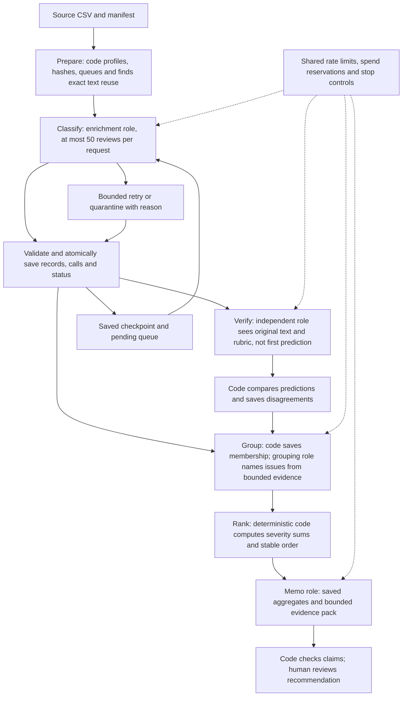

# Final Assignment — Multi Agent Large Data Processing Pipeline

A pipeline to turn historical Spotify Google Play reviews into a product recommendation supported by traceable evidence.

**Product question:** At the end of the review window, where should Spotify invest its next quarter of product effort: access, usability, playback, or billing/support? The proposed analysis will compare recurring complaints, their supported severity, and representative source evidence. No product recommendation has been produced yet.

**Deadline:** October 13, 2026, at 11:59 pm Pacific Time (America/Los_Angeles).

**Class 7:** October 13, 2026; class time has not been supplied.

**Submission:** This public repository will be the grader's entry point. Final submission through the course portal is pending.

## Current status

As of October 5, 2026, the supplied dataset packages have been inspected locally with streaming CSV parsing and SHA-256 checks. The assignment brief, dataset READMEs, manifests, `GRADING_CONTRACT.md`, and `COST_CALCULATOR.md` have been read. The offline ingestion stage has now run on the full input. Its saved core profile matches the course helper exactly.

The offline foundation uses Python 3.9+ and SQLite. It implements ingestion, exact-text deduplication, source hashes, schema validation, configuration-specific state, checkpoints, cost replay scaffolding, a manual-label CSV exporter, and isolated offline evaluation. **155 synthetic tests passed before the real Jev pilot.** DeepSeek through OpenCode CLI wrote the main pipeline foundation. Codex reviewed it, made targeted fixes, added the human-label tools, and ran the checks.

**Current coding choice:** DeepSeek V4 Flash 0731 from OpenRouter through OpenCode CLI; verified ID `openrouter/deepseek/deepseek-v4-flash-0731`. The two earlier build passes used OpenCode Go Vision Exp. See [build provenance](docs/build_provenance.md). No OpenRouter inference has run. Prices, billing route, and potential spend must be checked before further inference.

The 100-review Jev label pilot and separate Codex evidence extraction have run. An ignored local database holds 100 structurally complete classifications. Human evaluation, an end-to-end warm run, ranking, and the memo remain **pending**. A mechanically validated human golden CSV is available locally outside this repository. Label quality on this corpus is unmeasured. GLM is not selected for current work. Opus is a candidate for a small independent verifier sample. Development coding calls are separate from runtime model roles.

The [Jev enrichment adapter and bounded 100-review pilot runner](docs/jev_enrichment.md) began on `feat/jev-enrichment`; the canonical `feat/offline-foundation` branch now includes its two previously uncommitted evidence changes and the [entity boundary repair](docs/jev_entity_boundary_bug.md). The runner reserves worst-case spend before a call and supports offline replay. Hanif approved up to USD 0.60 from existing TypeSafe credits for the supplied `cost_100.csv` label pilot. That run saved 100 results from 100 settled attempts, used 87,887 input tokens, and accrued USD 0.003691254 at the recorded rate. A separately authorized Codex stage saved 100 exact evidence records, and an offline import saved 100 complete classifications. See the [aggregate pilot report](reports/jev-pilot-100.json). No Jev top-up or fallback was used. Cold wall time and Codex token usage were not recorded. A read-only warm replay made zero model calls; it is not an end-to-end warm pilot or a quality score.

The approved [topic rubric v2](docs/topic_rubric_v2.md) clarifies the same eight labels and the contract tie-break rules. The original 100-review pilot ledger and report remain v1; their cache identity differs from v2. The rubric review used development text only, and the evaluation plan discloses exact-text overlap with the blank golden source without accessing human answers. Rubric v2 was integrated locally at `a7b6f7d` and remains unpublished.

The user completed the [bounded v2 launch](docs/jev_v2_user_launch.md) on the same supplied `cost_100.csv`, using a separate ignored ledger. The [read-only v1/v2 comparison](reports/jev-rubric-v1-v2-100.md) validated 100 matched source rows and found 32 topic changes. Combined usage-derived Jev cost is USD 0.007953708, below the cumulative USD 0.60 limit. The v2 end-to-end wall time is unknown because its saved timing value is invalid; the runner timer is repaired for future runs. Only 24 v1 evidence records meet the strict v2 label-compatibility predicate. They were copied with original provenance into a separate ignored v2 evidence working ledger. The other 76 remain pending. Automatic approval review rejected the first new Codex extraction before it started because direct authorization for sending a private review to that service was not visible to the reviewer. No new review was sent. This is a development comparison, not a golden accuracy result or approval to scale.

Future paid execution requires configured credentials, verified API entitlement, and an approved spending limit. Offline replay must work without credentials; opening the calculator must never trigger paid calls.

## Implemented offline foundation

The `spotify_pipeline` package is runnable with no installation:

```text
python3 -m spotify_pipeline ingest --input PATH --manifest PATH --db PATH --report PATH
python3 -m spotify_pipeline status --db PATH [--config PATH]
python3 -m spotify_pipeline checkpoint --db PATH --out PATH --config PATH
python3 -m spotify_pipeline cost --measurements PATH --rates PATH --scenario PATH --out PATH
```

- `ingest` streams a strict UTF-8-sig CSV (strict `csv` mode; invalid UTF-8 becomes a clean error), verifies the input against the supplied manifest, validates every row, builds an adjacent temporary SQLite database, and publishes the database and a contract-compatible report. The report temp file is written before the database is replaced so report errors are caught first; a best-effort rollback restores the prior files. Empty text is quarantined as `empty_review_text`; a missing app version is counted with `not app_version.strip()` but not quarantined. It never overwrites the input or manifest and guards against SQLite `-journal`/`-wal`/`-shm` path collisions.
- `status` opens an existing database read-only (never creating a file) and prints source identity plus completed/pending/quarantined counts, optionally scoped to one configuration.
- `checkpoint` opens the database read-only and writes sorted original completed IDs plus configuration and source identity for resume. Pending rows never count as completed.
- `cost` replays saved measurements with editable dated rates using `Decimal`. Shipped cost-scaffold artifacts are `not_measured` with null rates and unset output/fallback caps, so totals stay unresolved, admission is blocked, and no scaling is approved. Test measurements are labelled `synthetic_fixture`. Projections are `not_implemented`. The main pipeline CLI has no paid execution command; the Jev pilot runner is a separate gated tool.

This is a local development branch and is not yet published. SQLite databases, sidecars, checkpoints and other local state are git-ignored; only aggregate reports under `reports/` are tracked.

Offline tests live in `tests/` and use synthetic fixtures in temporary directories only:

```text
python3 -m unittest discover -s tests -t . -v
```

See [implementation notes](docs/implementation.md), [build provenance](docs/build_provenance.md), [agent instructions](AGENTS.md), [coordination record](docs/tasks.md), and the [collaboration/runtime diagram](docs/architecture.md).

### Actual offline results

| Check | Result |
| --- | --- |
| Full-source IDs ingested | 660,622 |
| Nonempty reviews pending | 660,609 |
| Empty reviews quarantined | 13 |
| Runtime classifications | 0 |
| Distinct nonempty exact texts | 484,189 |
| Contract profile versus course helper | Exact match |
| Synthetic offline tests | 142 passed after evaluation-boundary tests |
| Local ingestion wall time | 118.151 seconds |
| Peak ingestion process memory | 26,476,544 bytes on this Mac |

These are local ingestion measurements. They are not pilot runtime or API-cost measurements. The SQLite file remains ignored and local. Reports contain aggregates and hashes, with no review text, original IDs, or private paths.

Saved evidence: [extended ingestion report](reports/ingestion.json), [exact contract profile](reports/contract-ingestion.json), [ingestion checks](reports/ingestion-checks.json), [offline verification](reports/offline-verification.json), and [unmeasured cost scaffold](reports/cost-scaffold.json).

After placing the supplied source and manifest in `data/`, run:

```sh
python3 -m spotify_pipeline ingest --input data/spotify_reviews_18months.csv --manifest data/manifest.json --db local/reviews.db --report reports/ingestion.json
python3 -m spotify_pipeline status --db local/reviews.db
python3 -m spotify_pipeline cost --measurements cost/measurements.json --rates cost/rates.json --scenario cost/scenario.json --out reports/cost-scaffold.json
```

No API key is needed. Close all database writers before re-ingestion. Status without a label configuration describes the source split; saved classification progress is reported per configuration. Checkpoints and result reuse have been tested with synthetic records only.

## Assignment references and scope

- [Assignment brief](https://docs.google.com/document/d/1PUFw56OGxqbUxiFm0vKtsWX8ac8633BgOlCSGa3TgLA/edit).
- `GRADING_CONTRACT.md` and `COST_CALCULATOR.md` in the expanded course dataset ZIP specify the export format and measured pilot requirements. These supplied files are not yet committed here.
- [Original dataset](https://www.kaggle.com/datasets/bwandowando/3-4-million-spotify-google-store-reviews), by BwandoWando, version 2, published November 17, 2023. The publisher lists CC0: Public Domain.

**Planned scope is the full corpus:** account for 660,622 original IDs, classify all 660,609 nonempty reviews, and quarantine the 13 empty texts with `empty_review_text`. Other unresolved nonempty reviews must remain visible and reduce successful classification coverage.

The current brief includes “or at least 100,000” in several passages, while other passages and the local grading contract require full coverage. This project targets the full contract; any reduced scope would need clarification and explicit disclosure. The older `spotify-insight-dataset` README describes sample processing, whereas the expanded `Final Assignment - Spotify Reviews Dataset` package adds the full-run contract, calculator specification, checker, and cost pilot. Their four shared CSVs are byte-identical. The expanded package is the planning reference.

## Verified dataset inventory

All supplied CSVs are comma-delimited UTF-8 without BOM, with LF line endings. Quoted review text can contain line breaks; count records with a CSV parser rather than physical lines.

| File | Bytes | Rows | Missing app version | Repeated nonempty exact-text occurrences after the first |
| --- | ---: | ---: | ---: | ---: |
| `spotify_reviews_18months.csv` | 97,400,616 | 660,622 | 159,701 | 176,420 |
| `analysis_10000.csv` | 1,477,793 | 10,000 | 2,447 | 1,552 |
| `checkpoint_500.csv` | 76,170 | 500 | 108 | 21 |
| `cost_100.csv` | 15,466 | 100 | 18 | 0 |
| `golden_50_to_label.csv` | 7,905 | 50 | 12 | 1 |

The full file is 97.4 decimal MB (approximately 92.9 MiB). Its SHA-256 is:

```text
1fc85de68a304dd8978b537cfa58793d5f41cbaf417fa32cb53899f83a2fcef6
```

The full corpus contains 660,622 unique IDs, 660,609 nonempty reviews, and 484,189 distinct nonempty exact texts. All CSVs have zero repeated review IDs. The full file has 13 empty texts and 159,701 missing app versions; no other source fields are blank. Samples have no empty texts. Inspection found no malformed row widths, invalid timestamps, ratings outside 1–5, or invalid/negative helpful-vote counts. All CSV checksums and byte sizes match their supplied manifests; both ZIPs match their expanded contents.

Observed full-corpus timestamps span **2022-05-17 00:01:07 through 2023-11-15 23:16:10**. The extraction window is May 17, 2022 inclusive through November 17, 2023 exclusive. Timestamp timezone is unspecified. The first and last calendar months are partial. The full file includes 68 multiline reviews. Average text length is 74.82 characters, with a maximum of 1,693; 106,648 reviews contain non-ASCII characters, which does not by itself establish language.

The six source columns, in order, are `review_id`, `review_text`, `review_rating`, `review_likes`, `app_version`, and `review_timestamp`. The original row index, author names, and author IDs were removed in the course extract; `author_app_version` was renamed to `app_version`. Text was not translated or redacted.

The golden template adds `topic`, `intent`, `sentiment`, `severity`, `entities`, `evidence_quote`, and `needs_review`. All seven label columns are currently blank in all 50 rows.

### Samples and evaluation boundary

Actual source-row comparison confirms that `cost_100.csv` is the first 100 checkpoint rows, the checkpoint is the first 500 analysis rows, and all 10,050 distinct sample IDs occur unchanged in the full corpus. Golden IDs are disjoint from the development samples.

**Known exact-text overlap:** six golden rows, representing five distinct texts, also occur in the 10,000-review development sample under different IDs. ID separation therefore does not guarantee text separation. Before evaluation, the plan is to identify these cases, exclude matching golden texts from prompt-tuning examples and issue-discovery inputs, disclose overlap and any cache reuse, and report agreement with the limitation visible. Any golden-informed revisions require disclosure and fresh held-out cases for a final check.

Golden labels must be supplied by a human. All 50 human-labeled rows are a required prerequisite for final evaluation. See [human labeling guidance](docs/human_evaluation.md). Expected labels must never enter model prompts, examples, routing thresholds, cache inputs, or issue-discovery inputs. All original golden texts still belong in the final full-corpus run. Synthetic tests must remain outside business aggregates.

The human labeling guide now includes the course-aligned severity scale and optional sentiment anchors. Severity measures reported harm or lost function; sentiment measures tone. The two scores are independent, and stars do not set either score. The invented examples are guidance only. Human labels remain pending.

The local `../human-evaluation/golden_50_human_labels.xlsx` workbook makes manual labeling easier. Its dropdowns cover all 50 rows for topic, intent, severity, and needs-review. Sentiment accepts a manually entered decimal from −1 to 1; entities and an exact evidence quote remain manual. All seven answer fields were blank when created. The six original source fields are preserved, and rating is visually muted to keep attention on the review text. The blank source CSV and workbook stay outside this public repository. Neither creates human answers.

Open the workbook in Excel or another spreadsheet app, fill every amber answer cell, and save it as `.xlsx`. From the repository root, export a separate completed CSV with:

```sh
python3 tools/export_human_labels.py --workbook ../human-evaluation/golden_50_human_labels.xlsx --source ../human-evaluation/golden_50_human_labels.csv --out ../human-evaluation/golden_50_human_labels_completed.csv
```

The exporter checks that all 50 rows are complete, the six source columns match the verified blank template, and answer values have valid formats. It refuses to overwrite an existing file. It cannot judge whether a human label is semantically correct. The original course CSV is never the export destination. A blank workbook fails export as intended; a completed answer CSV requires explicit validated export.

**Human-label export, October 6:** all 50 rows and 350 answer cells passed mechanical validation. The completed CSV is in the sibling `human-evaluation/` folder and remains outside Git. Its SHA-256 is `ff084828aa2d88970e70508dd36362aaaade3d48a1d1ee1d09503e24ffaeb0f6`. At Hanif's request, an assistant corrected only case or whitespace in four human-selected `evidence_quote` spans (Excel rows 15, 21, 30, 42), after each matched one unique substring of its own source review. A private workbook backup was saved first. All other workbook cells and all six source fields remained unchanged. Format validation does not certify semantic label quality.

An [offline evaluation tool](tools/evaluate_human_labels.py) gates on the complete, valid human CSV and scores saved predictions using deterministic code. It returns aggregate diagnostics without texts, IDs, or individual answers. It has passed synthetic boundary tests; no real evaluation has run because runtime predictions do not exist yet. The runtime source parser accepts only the six original columns, so expected-answer columns cannot enter that input route.

### Obtain and prepare data

Download the expanded eleven-file course ZIP from the dataset link in the assignment brief, then extract it locally into a proposed `data/` directory. Preserve originals and validate against the supplied `manifest.json`, including the full-file checksum above. Raw CSVs are not part of this initial commit.

The supplied `prepare_dataset.py` can reproduce the course extract from the pinned original Kaggle ZIP using Python's standard library. Its documented interface is a source ZIP path with an optional `--output` directory. The [pinned version-2 source download](https://www.kaggle.com/api/v1/datasets/download/bwandowando/3-4-million-spotify-google-store-reviews?datasetVersionNumber=2) is separate from the smaller course ZIP. Reproduction has not been run for this project. The offline commands above are implemented. Runtime model commands will be added after implementation and verification.

## Proposed architecture

The orchestrator will accept an input CSV path and coordinate six stages. Code will own ID accounting, hashing, schema validation, state, budgets, and arithmetic. Model roles will interpret text through bounded tasks. Every stage will have versioned inputs, saved outputs, a failure path, and a stop condition.



| Stage | Owner and input | Planned saved handoff | Failure/stop behavior |
| --- | --- | --- | --- |
| Prepare | Code; CSV and manifest | Full profile, original row hashes, pending IDs, exact-text index | Reject invalid input identity; preserve source values and report quality issues |
| Classify | Enrichment role; original text and shared rubric | Validated records, call evidence, direct cache provenance | At most 50 reviews/request; one invalid-output retry, then retain failure/quarantine; bounded transient-error retries |
| Verify | Independent verifier; original text and rubric, without enrichment prediction | Declared random-sample predictions and disagreement report | Save verifier failures and ambiguous cases; independent does not imply guaranteed correctness |
| Group | Code and grouping role; complaint/cancellation records and bounded examples | Stable issue IDs and accepted review membership | Reject foreign IDs and duplicate pairs; disclose any justified multiple membership |
| Rank | Code; saved records and membership | Aggregates, baseline ranking, claims table | Deterministic validation fails visibly on inconsistent inputs; no model calls |
| Recommend | Memo role; saved aggregates and bounded evidence | Decision memo with claim and issue references | Reject unsupported IDs/numbers; human review before final recommendation |

Provider selection is pending. SQL/ordinary code and Jev are recommended starting options in the assignment, with alternatives allowed when justified and evaluated. Models are needed for messy-language interpretation and bounded naming/writing tasks; counting, filtering, sorting, and ranking will use code. Stars remain metadata and must not substitute for text-based intent or severity.

## Shared schema and ranking contract

Primary topics: `access`, `usability`, `playback`, `downloads`, `catalog`, `billing`, `support`, `other`. Intent precedence: `cancellation`, `complaint`, `request`, `praise`, `unclear`.

Severity: 1 = no reported problem/praise/unclear/pure request; 2 = annoyance or generic criticism; 3 = degraded or restricted function with some use remaining; 4 = a clearly blocked core task; 5 = explicit serious financial, privacy, or data harm. Cancellation intent and angry language alone do not raise severity. Choose the highest supported severity problem, then the first specific problem on a tie. Complete boundaries and application examples will follow the supplied grading contract.

A completed record must include `review_id`, `source_sha256`, `status`, `topic`, `intent`, `sentiment` in −1 to 1, integer `severity` in 1–5, `entities`, an exact-source-substring `evidence_quote`, boolean `needs_review`, and versioned `label_config`. Quarantines retain the ID, source hash, and reason. Source hashing uses compact UTF-8 JSON of the six exact original field strings in source-column order, through the supplied helper; whitespace and accents must not be normalized.

The Jev evidence adapter also requires entity names to have clean edges and a whole-word source match. Evidence quotes remain exact substrings and may be shorter snippets. See the [entity boundary bug record](docs/jev_entity_boundary_bug.md) for the saved-pilot check and repair scope.

Exact-text result caching will require identical model, effort, prompt, and schema settings. Each reused output keeps its own original ID and points directly to a completed original via `cache_source_id`; cache chains are disallowed. Reuse reduces calls, not business counts. Saved results/statuses must be atomic and resume must avoid new enrichment calls for completed IDs under unchanged configuration.

The baseline includes completed `complaint` and `cancellation` records. Each belongs to an issue, normally one. Each `(issue_id, review_id)` pair occurs once; praise, requests, and unclear records are excluded. Any multiple-issue design must declare overlap.

`priority_score = complaint_count × mean_severity = severity_sum`.

Sort by descending integer severity sum, then ascending issue ID; ranks start at 1. Export mean severity to six decimals with decimal half-up rounding. Reranking must reproduce the same scores and order from saved records/membership without model calls. The memo must cite `claims.csv` claim IDs for material issue-level numbers.

## Roadmap and planned artifacts

1. **Prepare:** add dependency/setup documentation, blank credential examples, ignore rules, label examples, prompts, schema, input-path interface, full ingestion profile, and original-row accounting. The offline ingestion/state/schema/cost foundation and setup files are implemented; prompts, label examples and model roles are pending.
2. **Human evaluation preparation:** hand-label the golden 50 and establish the overlap policy before final evaluation; use development records for tuning.
3. **Measured 100-review pilot:** implement the calculator and actual pipeline; use `cost_100.csv` unchanged, an empty result cache, and one worker. Include enrichment, declared verification, grouping, ranking, and memo. Record all statuses and attempts. Repeat warm with saved results and demonstrate zero new enrichment calls under unchanged settings; disclose downstream calls.
4. **500-review checkpoint:** demonstrate the enricher, evaluate labels and failures, test interruption/resume, and refresh cost/runtime estimates before Class 7.
5. **10,000-review checkpoint:** refresh quality, cache, retry, throughput, cost, and fallback assumptions; document a scaling decision within the approved budget.
6. **Full corpus:** account for all IDs, classify nonempty texts, record quarantines and failures, independently verify a declared sample, save issue membership, regenerate ranking, and write the grounded memo.
7. **Submission checks:** run the provided zero-API checker, test offline calculator/ranking and setup in a clean environment, verify public evidence access, and complete the rubric evidence map. Final submission remains pending.

Planned repository artifacts are listed as plain paths because they do not exist yet:

| Planned artifact | Purpose | Status |
| --- | --- | --- |
| Source program, dependency versions, role prompts, schema, label examples, blank `.env.example`, `.gitignore` | Runnable staged implementation and safe setup | Partial: offline foundation and setup files implemented; prompts and label examples pending |
| Full ingestion report and run/data manifests | Checksum, profile, code/config versions and provenance | Ingestion reports saved; runtime manifest pending |
| `grading/run.json`, `ingestion.json`, `records.jsonl`, `membership.csv`, `ranking.csv`, `claims.csv`, `calls.jsonl`, `checkpoint_before.json`, `checkpoint_after.json` | Standardized grading export, including completed and quarantined IDs | Pending |
| `cost/` calculator, `pilot_records.jsonl`, `pilot_calls.jsonl`, editable rates/usage, report, offline replay instructions | Real cold/warm measurements and reproducible projections | Jev 100-review label/evidence ledger, completed sample database, and aggregate report exist locally; end-to-end warm and full calculator evidence and projections pending |
| `evals/` human labels, predictions, comparisons, verifier results, system tests | Actual evaluation and inspected failures | Pending |
| Run logs, quarantine details, interruption/resume recording | Usage, attempts, timing, recovery and stop evidence | Pending |
| Decision memo, real review trace, failed/ambiguous case trace | Recommendation tied to source, membership, ranking and claims | Pending |

Large saved outputs may be supplied as accessible downloadable assets; JSONL grading files may be gzip-compressed. Evidence links will be added after artifacts exist and are verified. Offline ingestion, status, checkpoint, cost replay, Jev pilot, and Jev ledger replay commands are available. The 100-review evidence and completed-classification databases are local, ignored artifacts; the combined branch was integrated locally into `feat/offline-foundation` at `e24c3c6`; publication remains pending.

## Cost, recovery, and evaluation requirements

The calculator must replay saved real usage with editable dated prices offline by default. Paid execution must be an explicit separate operation. Report exact provider/model/settings, prompt/schema versions, batches/workers, per-stage attempts and outcomes, usage, price units/currency/source dates, cache hits, throughput, end-to-end wall time, and cold/warm costs. Missing usage or charges stay visibly unresolved or explicitly estimated. API spend, local-compute estimates, and unknown costs remain separate.

Billing arithmetic is mutually exclusive billed units × price per unit, with no double-counted cached-input or reasoning charges. Projections must show 660,609 nonempty rows and the 484,189-distinct-text reuse comparison, fixed overhead once, stage-specific verification/fallback work, and base/conservative assumptions. Projected volume must not change measured pilot results. With fixed usage, doubling API rates must double API subtotal while leaving measured time and local costs unchanged.

Before scaling, declare spending, output-token, concurrency, and fallback limits. Start at one worker; increase only after comparable measurements. Share rate limits and a spend ledger; reserve worst-case in-flight cost before dispatch, stop admitting work at the cap, save progress, and reconcile uncertain timeout charges. Extra cold experiments require budget coverage. Provider prompt caching is separate from saved-result caching.

Pending evaluations include topic/intent agreement, per-topic counts and confusion analysis, severity exact agreement and mean absolute error, predeclared sentiment tolerance or error, quote substring/support checks, unsupported entities, ambiguous cases, and `needs_review` behavior. Save expected labels, predictions, per-case outcomes, and concrete error analysis. Fifty cases are a small diagnostic sample.

System checks must cover malformed output, missing text, ambiguous/unsupported-language cases, temporary API failure, bounded retries, spending controls, injected instructions in synthetic reviews, a planted wrong label, and interruption/resume. The verifier re-labels original text before seeing the first prediction. Synthetic cases remain separate from business results. Demonstrate additional completed records after restart, no relabeling of completed IDs under unchanged settings, and repeatable offline ranking.

## Rubric evidence checklist

No rubric category is complete yet. The offline foundation supplies initial evidence. It does not demonstrate runtime execution, label quality, or a finished recommendation.

| Category | Criterion | Evidence to provide | Status |
| --- | --- | --- | --- |
| Deliverable quality (4) | Accessible code/setup and artifacts | Tested setup, dependencies, runnable program, accessible saved evidence | Partial: offline commands and reports exist; staged runtime pending |
| Deliverable quality | Architecture, schema and provenance | Implemented roles, prompts, manifests, schema and saved handoffs | Pending |
| Deliverable quality | Correct memo numbers and source evidence | Claims reconciled to records, membership and deterministic calculations; real trace | Pending |
| Deliverable quality | Coherent recommendation and limitations | Memo, alternatives and inspected source examples | Pending |
| Testing & evaluation (3) | Human golden labels and error analysis | 50 human labels, per-field comparisons, disagreements and overlap disclosure | Pending |
| Testing & evaluation | Independent verification and adversarial checks | Verifier procedure/results, planted-error and injection outcomes | Pending |
| Testing & evaluation | T3 cost/recovery evidence | Real cold/warm 100 pilot, correct offline calculator, retry/spend/recovery demonstrations | Pending |
| Working result (3) | Full ingestion and classification coverage | Exact profile, one final record per ID, completed/quarantined accounting | Ingestion verified; classification and grading export pending |
| Working result | Runnable bounded stages and resume | Saved handoffs, call logs, checkpoint snapshots and recording | Pending |
| Working result | Reproducible ranking and grounded output | Offline ranking, checker results and usable final memo | Pending |

The coverage component distinguishes accounting from successful classification: `0.2 × exact full-file profile match + 0.2 × valid accounted rows / 660,622 + 0.6 × valid classified nonempty rows / 660,609`. Duplicate/invalid records do not count; quarantining nonempty text does not count as successful classification. The provided checker audits consistency, while humans assess label meaning and recommendation quality.

## Limits and interpretation

These are self-selected public reviews from a historical snapshot, not the complete customer population. The data contains no account revenue, plan tier, confirmed cancellations, or observed retention effects. Cancellation text expresses intent. The eventual memo must avoid revenue-at-risk estimates and causal claims, disclose missing versions and incomplete classifications, and avoid unnecessary personal details. Any trend analysis must report denominators, comparable periods, and partial-month boundaries.

This README records verified input facts, actual offline ingestion, and planned runtime work. Final conclusions will be added after runtime execution and evaluation are saved.

### Coding model price reference

See [dated OpenRouter provider prices](docs/coding_model_prices.md). These are quoted rates, not measured charges or a universal model price. Actual route, usage, and charges remain unmeasured.
