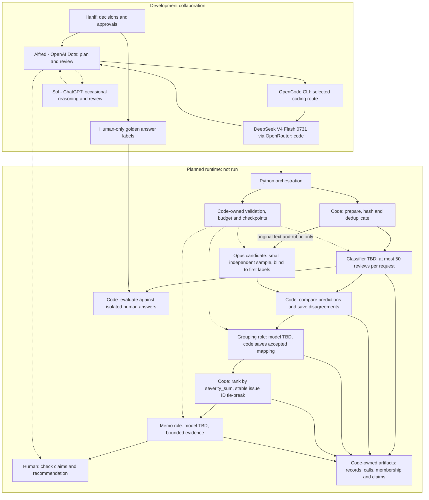

# Agent collaboration and planned runtime

The two groups have different jobs. Development agents help build and review
the code. Runtime roles will process reviews after access, quality, and budget
checks. The offline foundation is under review. The runtime has not run.

Hanif makes decisions and supplies the golden answers. Alfred is OpenAI Dots
and coordinates the plan and review. DeepSeek V4 Flash 0731 uses OpenRouter
through OpenCode CLI for future code work.
The two past coding passes used OpenCode Go; see `build_provenance.md`.
Sol is ChatGPT and can help with occasional reasoning. Coding runs through
OpenCode CLI.

Python will dispatch bounded tasks and save handoffs. The verifier will receive
original text and the rubric before it sees the classifier's prediction.
Grouping will produce a saved mapping. Code will calculate the ranking.
The memo role will receive saved aggregates and a small evidence pack.
A human will check the final argument.

Golden answers flow only to code evaluation. They never enter model inputs.
GLM is not selected. Opus remains a verifier candidate. Runtime access and pilot quality are pending.
The project ceiling is US$49.99. Paid execution still needs approval.
Saved state, validation, and budget controls are code responsibilities.
The live controls and full runtime remain unimplemented.

This is a GitHub Mermaid diagram. It describes responsibilities and planned
handoffs. It does not prove execution, automatic coordination, or shared locks.
